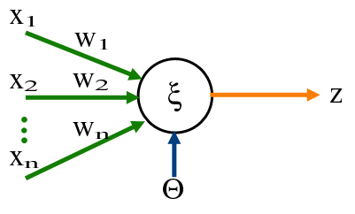

---

layout: post
read_time: true
show_date: true
title:  单神经元感知器
date:   2021-01-25 13:32:20 -0600
description: 单神经元感知器可以非常快速地对元素进行分类学习。
img: posts/20210125/Perceptron.jpg
tags: [机器学习, 神经网络]
author: Jeremiah
mathjax: yes

---

作为学习 Python 和进入机器学习的切入点，我决定从头开始编写该领域的 Hello World！，即单神经元感知器。(Single Neuron Perceptron)

## 什么是感知器(Perceptron)？

感知器是神经网络的基本组成部分，可以比作神经元，它的提出引爆了当今广阔的人工智能领域。

早在 1950 年末，年轻的 [Frank Rosenblatt](https://en.wikipedia.org/wiki/Frank_Rosenblatt) 设计了一种非常简单的算法，作为构建能够学习执行不同任务的机器的基础。

从本质上讲，感知器只不过是一些值和通过它们传递信息的规则的集合，但其简单性却蕴含着它的强大力量。

想象一下，你有一个“神经元”，为了“激活”它，你需要传递多个输入信号，每个信号通过突触连接到神经元。一旦信号在感知器中聚合，它就会被传递到一个或多个定义的输出。感知器就是一个神经元及其突触的集合，用于接收信号并修改信号以进行传递。

用更数学的术语来说，感知器是一个值数组（我们称之为权重），以及将这些值应用于输入信号的规则。

例如，感知器可以获得如图所示的 3 个不同的输入，假设它接收的输入信号为：$x_1 = 1, \; x_2 = 2\; and \; x_3 = 3$, 如果它的权重分别为 $w_1 = 0.5,\; w_2 = 1\; and \; w_3 = -1$ 那么感知器在接收到信号时会做的是将每个输入值乘以其对应的权重，然后将它们相加。

$\left(x_{1} * w_{1}\right)+\left(x_{2} * w_{2}\right)+\left(x_{3} * w_{3}\right)$

$(1 * 0.5) + (2 * 1) + (3 * -1) = 0.5 + 2 - 3 = -0.5$

通常当获得这个值时，我们需要应用“激活”函数来平滑输出，但假设我们的激活函数是线性的，这意味着我们保持该值不变，那么就是这样，这就是感知器的输出，-0.5。

在实际应用中，输出意味着某种东西，也许我们希望感知器对一组数据进行分类，如果感知器输出一个负数，那么我们就知道数据是 A 型，如果它是一个正数，那么它就是 B 型。

一旦我们理解了这一点，奇迹就会通过一个叫做反向传播的过程开始发生，在这个过程中，我们“教育”我们微小的神经元大脑，让它学习如何完成它的工作。

<tweet>奇迹开始通过一个叫做反向传播的过程发生，在这个过程中，我们“教育”我们微小的单神经元大脑，让它学习如何完成它的工作。</tweet>

为此，我们需要一组已经分类好的数据，我们称之为训练集。这些数据包含输入及其对应的正确输出。这样，我们就可以告诉“小脑袋”它预测错误的时间，并通过这样做，我们也会根据感知器犯错的方向稍微调整权重，希望经过多次这样的迭代后，权重能够使大多数预测都正确。

模型训练成功后，我们可以让它对从未见过的数据进行分类，并且我们有相当高的信心它会正确地做到这一点。

感知器这一神奇特性背后的数学原理被称为梯度下降，它其实只是一些微积分，可以帮助我们将大脑产生的误差转化为权重值向最优值的微小调整。[3 blue 1 brown 的这个视频系列对此进行了精彩的解释。](https://www.youtube.com/watch?v=aircAruvnKk&list=PLZHQObOWTQDNU6R1_67000Dx_ZCJB-3pi)

我的程序创建了一个单神经元神经网络，用于猜测某个点是在随机生成的线之上还是之下，并根据图形生成可视化效果，以查看神经网络如何随时间进行学习。

神经元有 3 个输入和权重来计算其输出：

    输入 1 是点的 X 坐标，
    输入 2 是点的 y 坐标，
    输入 3 是偏差bias，始终为 1
    
    对于不穿过原点 (0,0)的线，需要输入 3 或偏差

感知器从将权重全部设置为零开始，并通过每次迭代使用 1,000 个随机点进行学习。

感知器的输出通过以下激活函数计算：如果 $ x * weight_x + y * weight_y + weight_{bias}  $ 为正则为 1 否则为 0

每个点的误差计算为感知器的预期结果减去实际结果，因此只有 3 个可能的误差值：

| Expected | Calculated | Error |
|:--------:|:----------:|:-----:|
| 1        | -1         | 1     |
| 1        | 1          | 0     |
| -1       | -1         | 0     |
| -1       | 1          | -1    |

对于每个学习到的点，如果误差不为 0，则权重将根据以下公式进行调整：

    New_weight = Old_weight + error * input * learning_rate
    for example: New_weight_x = Old_weight_x + error * x * learning rate

所有神经网络中一个非常有用的参数是学习率，它基本上衡量了我们对权重的推动有多小。

在这个特殊情况下，我将 learning_rate 编码为随着每次迭代而减少，如下所示：

    learning_rate = 0.01 / (iteration + 1)

这对于确保一旦权重接近最佳值，每次迭代中的调整都会更加微妙非常重要。

最后，感知器总是会收敛到一个解决方案，并以极高的精度找到我们正在寻找的线。

感知器非常具有启发性，因为它们可以通过学习来求解方程，然而它们的能力非常有限。由于其本质，它们只能求解线性方程，因此它们的问题空间非常狭窄。

如今，神经网络由许多感知器、多层以及其他类型的“神经元”（如卷积、循环等）组合而成，大大增加了它们解决的问题类型。
