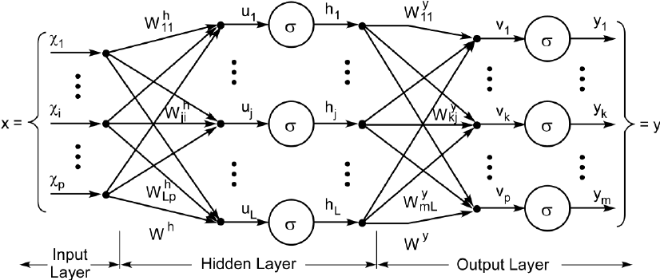
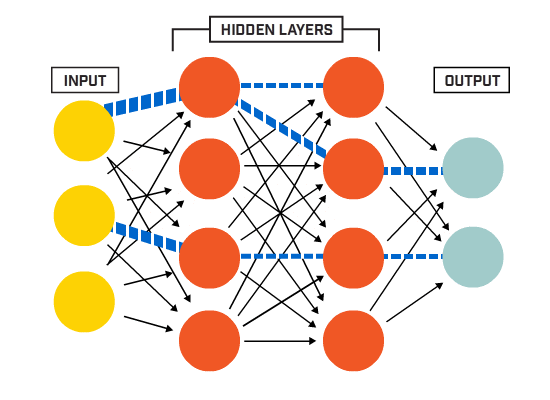
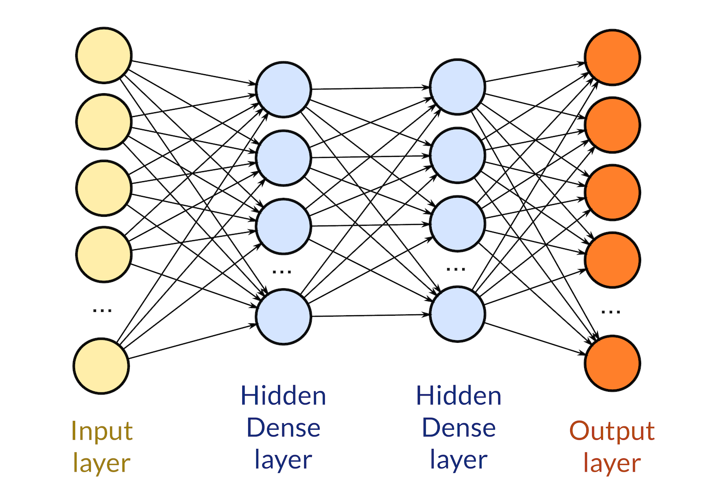

如今，科技无处不在，阅读有关人工智能的新闻已是司空见惯。这些新闻标题涵盖了商业、制造、供应链、医药和生物技术，甚至国防等领域。毫无疑问，人工智能领域的进步，尤其是机器学习和深度神经网络，已经渗透到我们的日常生活中，并将持续存在。但是，当我们说“人工智能”时，普通民众知道我们在说什么吗？我认为大多数人正确地想象它是一种计算机算法，或者也许更有冒险精神的人会想到一台物理机器、一个先进的计算机实体，甚至是一个机器人，它会随着我们给它带来的每一个用例而变得越来越聪明。大多数人都是对的，当提到“人工智能”时，它确实是一种由计算机运行的算法，而这正是他们知识的边界所在。

他们说学习某件事的最好方法是尝试解释它，所以在个人练习中，我将尝试做一个 ELI5 (**E**xplain it **L**ike **I** am **5**) 版本的神经网络。

让我们先从一点历史开始，人类对智能机器的想法已经摸索了一段时间了，有人甚至说人工智能的想法是由古希腊人构想出来的（ 来源 ），历史上也曾多次尝试设计“智能”机器，其中最引人注目的是查尔斯·巴贝奇于 1837 年发明的“分析机”。

之后, 上世纪中叶，为了构建大脑运作模型，神经网络应运而生。大约在那个时候，康奈尔大学的弗兰克·罗森布拉特（Frank Rosenblatt）为了理解普通家蝇眼睛里存在的简单决策系统，提出了[perceptron](../single-neuron-perceptron)感知器的概念。感知器是一个非常简单的系统，它通过基本的数学运算处理特定的输入并产生输出。

这个想法非常强大，即使在今天，它仍然是我们所说的人工智能的基本组成部分之一。

为了说明这一点，假设苍蝇的大脑是一个感知器，它的输入是其眼睛中多个细胞产生的任何值。当眼睛细胞检测到“某物”时，它的输出为 1，如果没有检测到任何物体，则输出为 0。然后，感知器（苍蝇的大脑）可以处理所有这些输入的组合，输出为简单的 0 或 1。如果输出为 1，则大脑指示苍蝇逃跑；如果输出为 0，则表示留在原地是安全的。

我们可以想象，如果苍蝇的许多眼细胞都产生了 1，这意味着物体非常近，因此感知器将计算出 1，是时候逃跑了。

感知器只是一种数学运算，它将某些输入值与预设的“参数”（称为权重）相乘，然后将得到的乘积相加以生成一个值。

魔法火花随之迸发，感知器的参数（权重）可以通过最小化特定观测的已知结果与感知器实际计算结果之间的差异的过程进行“学习”。这个学习过程，我们称之为 **神经网络训练**.

从这里我将尝试解释这个简单的概念如何能够有如此多样化的应用，如自然语言处理（想想 Alexa）、图像识别（如通过 CTR 扫描进行医学诊断）、自动驾驶汽车等。

一个基本的神经网络是由不同排列的感知器组合而成的，感知器因此被从“苍蝇大脑”降级为“网络神经元”。

神经网络具有不同的组成部分，其基本形式包括：
- Input 输入
- Hidden layers 隐藏层
- Output 输出

### Input

神经网络的输入本质上就是数字，因此任何可以转换为数字的东西都可以成为输入。文本中的字母、图像中的像素、声波中的频率、传感器的值等等，都是不同的事物，它们在转换为数值后，都可以作为神经网络的输入。这也是神经网络应用如此多样化的原因之一。

输入的数量可以根据任务需求而定，从训练神经网络玩井字游戏所需的9个输入，到自动驾驶汽车摄像头的数千个像素。由于感知器的输入必须是单个值，例如，如果选择一个彩色像素作为输入，它很可能会被分解成三个不同的值：红色、绿色和蓝色分量，因此每个像素将成为神经网络的三个不同输入。

### Hidden layers

神经网络中的“层”其实就是一组感知器，它们对输入执行完全相同的数学运算并产生输出。关键在于，每个感知器都有不同的权重（参数），因此给定输入时，它们产生的输出也会有所不同。层有很多种类型，其中最典型的是“密集”层，换句话说，所有输入都连接到所有神经元（单个感知器），并且如前所述，每个连接都具有相应的权重，因此每个神经元执行的操作只是所有输入的简单加权和。

隐藏层通常连接到另一个密集层，它们的连接意味着第一层神经元的每个输出都被有效地视为后续层的输入，因此它连接到每个神经元。

神经网络可以具有从一层到人们能想到的任意多层的层数，并且层数完全取决于我们在想要解决的特定问题上积累的经验。

隐藏层的另一个关键参数是神经元的数量，同样，我们需要依靠经验来确定特定问题所需的神经元数量。我见过的网络从几个神经元到数千个神经元不等。当然，每个隐藏层可以拥有任意数量的神经元，因此组合的数量非常多。

层数、层类型以及每层有多少个神经元，就是我们所说的*网络拓扑结构* （包括输入和输出的数量）。

### Output

在这条链的最末端，还有另一层（其行为类似于隐藏层），但它的特点是它是最后一层，因此它计算的结果将成为整个网络的输出值。网络的输出数量取决于我们想要解决的问题。它可以简单到只有一个输出，其值代表某个动作的概率（例如家蝇的逃跑反应）；也可以有多个输出，例如，如果我们的网络试图区分动物图像，那么每个动物物种都会有一个输出，而这个输出代表网络对特定图像属于相应物种的置信度。

正如我们所说，神经网络只是单个神经元的集合，它们在一系列层级中对某些输入进行基本的数学运算，最终产生输出。然后，这组神经元网络会根据已知输入情况的特定输出值进行“训练”；一旦它学会了，它就能处理新的输入，即使是它从未见过的输入值，也能获得令人惊讶的精确结果。

神经网络解决的许多问题当然可以通过其他算法解决，但是，由于神经网络的核心是极其基本的操作，一旦经过训练，它们就会非常高效，因此可以更快、更经济地产生结果。

为了尽可能简化解释，我特意省略了一些关于简单神经网络运作的细节。诸如偏差、激活函数、学习背后的数学原理以及反向传播算法等概念，我将留到另一篇更深入的文章中探讨。除了感知器之外，我还会撰写（或许会以系列形式）关于结合不同类型的层和其他构建块的更复杂拓扑结构的文章。