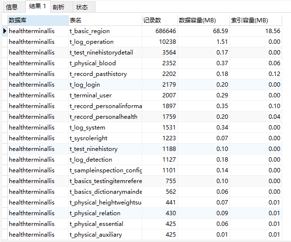

## 前言

最近上线了一个项目，运行了一个月。想知道mysql库中，哪个表最大？有多少行数据？

由于库里面有上百张表，一个个查看比较费劲。

## 查询表大小

如果我需要查询的库名为：kite  
那么查询的sql语句为：  

```sql
select
    table_schema as '数据库',
    table_name as '表名',
    table_rows as '记录数',
    truncate(data_length/1024/1024, 2) as '数据容量(MB)',
    truncate(index_length/1024/1024, 2) as '索引容量(MB)'
from information_schema.tables
    where table_schema='kite'
    order by table_rows desc, index_length desc;
```

结果如下：

