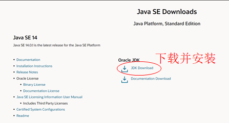
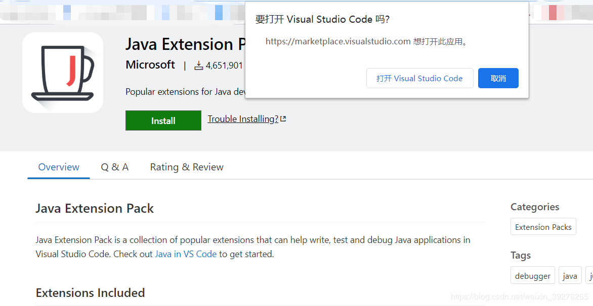
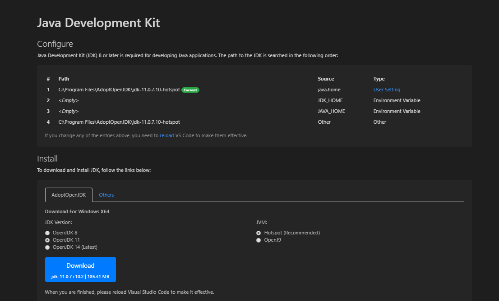
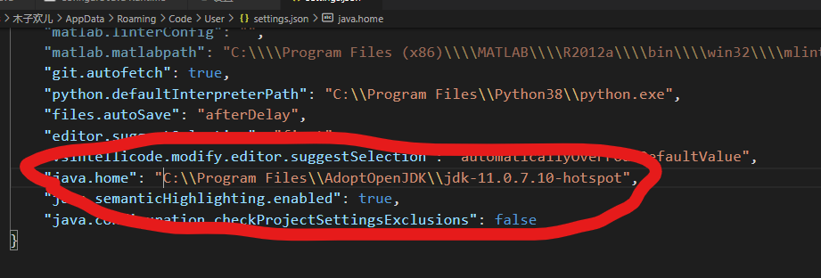
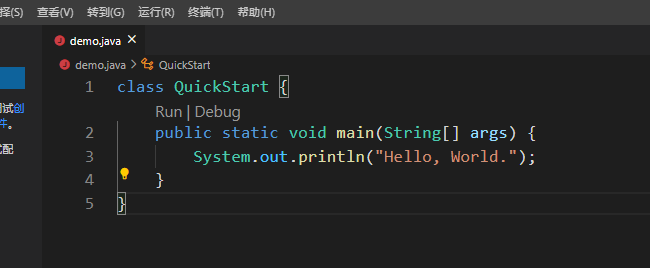
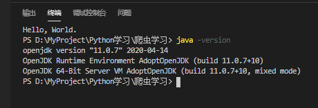
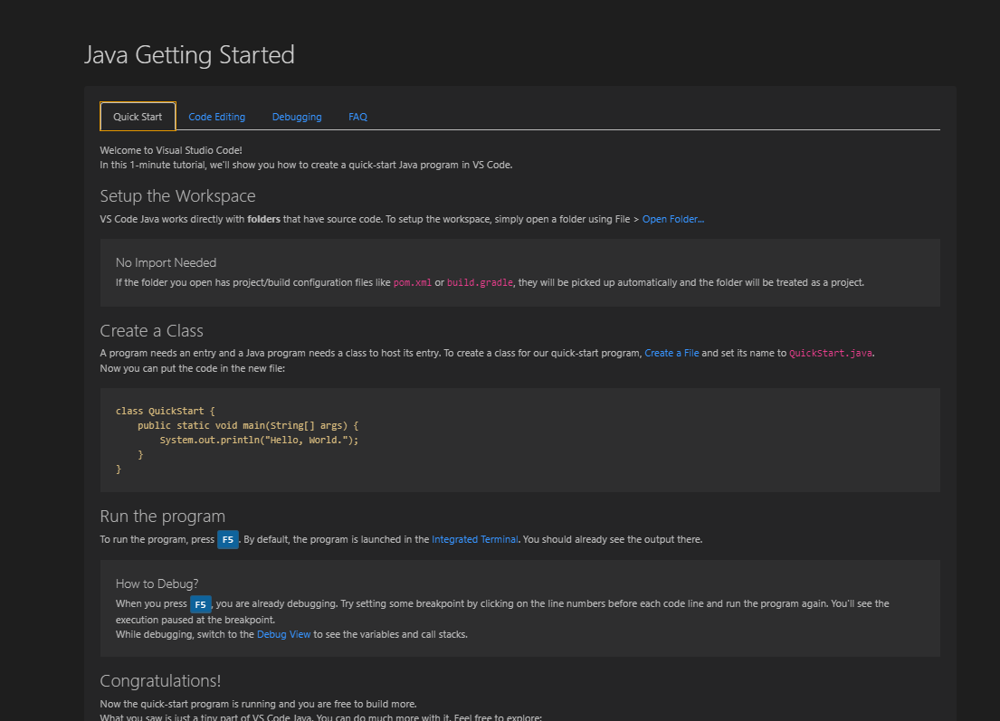

<h2>配置Java开发环境</h2>

主要参考官方教程：<a href="https://code.visualstudio.com/docs/java/java-tutorial" rel="nofollow">https://code.visualstudio.com/docs/java/java-tutorial</a>

<h3> 1.先安装JDK</h3>

JDK下载地址：<a href="https://www.oracle.com/java/technologies/javase-downloads.html" rel="nofollow">https://www.oracle.com/java/technologies/javase-downloads.html</a>

<h3>2.配置变量</h3>

配置 JAVA  环境变量：参考 <a href="https://www.cnblogs.com/happyAzhan/p/11271274.html">https://www.cnblogs.com/happyAzhan/p/11271274.html</a>；

<h3>3.安装 Java Extension Pack</h3>

这个Java Extension Pack是6个扩展的一个集成，只需要安装这一个就可以了，很方便。

直接点击链接：https://marketplace.visualstudio.com/items?itemName=vscjava.vscode-java-pack或者在VScode拓展那里安装

然后会提示：

 选择打开就好。然后在VS Code中点install就好。

<h3>3.配置VS Code的jdk版本</h3>

在VS Code界面键入：<code>Ctrl+Shift+P</code>，然后输入：<code>Java: Configure Java Runtime</code> 如下图：

 这里填一下jdk路径

<h3>4.开始编写Java程序：Hello，world！</h3>

然后<code>F5</code>就可以运行了。

自然会有想要的输出。 如果没有输出，或者报错： 1）确认自己是不是安装了<code>Java Extension Pack</code> 2）在下方terminal输入：<code>java -version</code>确认一下jdk是不是装了。

 备注： 在VS Code界面同时按：<code>Ctrl+Shift+P</code>，然后输入：<code>Java: Getting Started</code>就能看到一些有关java开发的提示了（快捷键之类的，还是很友好的）。

