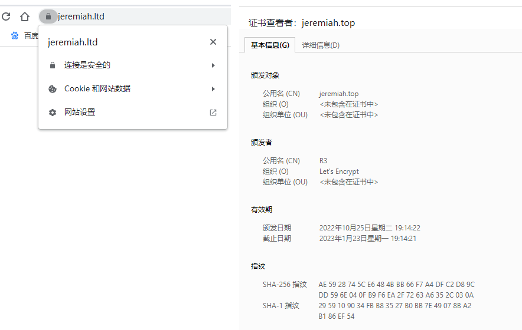
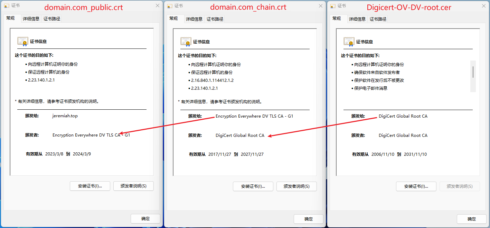
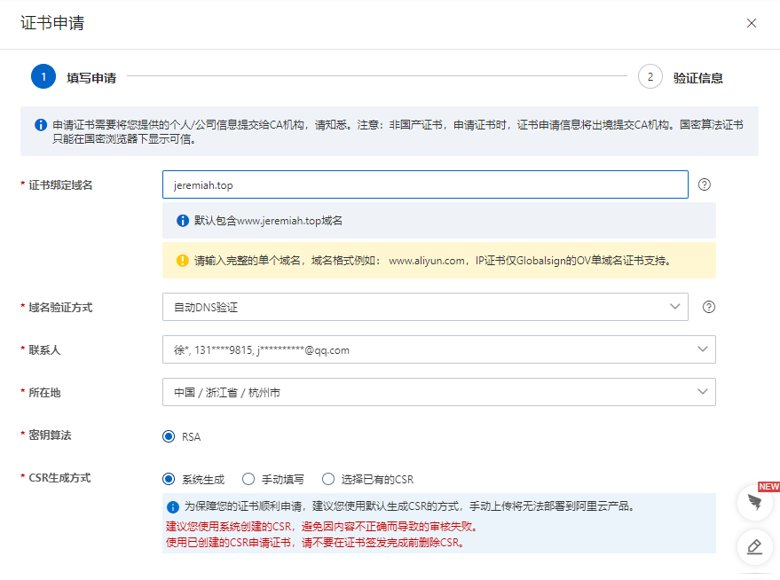
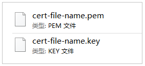

🔆让你的http加一个s

SSL证书是[数字证书](https://baike.baidu.com/item/%E6%95%B0%E5%AD%97%E8%AF%81%E4%B9%A6/326874?fromModule=lemma_inlink)的一种，类似于驾驶证、护照和营业执照的电子副本。因为配置在服务器上，也称为SSL服务器证书。

SSL 证书 [1]  就是遵守 [SSL协议](https://baike.baidu.com/item/SSL%E5%8D%8F%E8%AE%AE/4602579?fromModule=lemma_inlink)，由受信任的数字证书颁发机构CA，在验证服务器身份后颁发，具有服务器身份验证和数据传输加密功能。

SSL/TLS 协议的基本思路是采用公钥加密法，也就是说，客户端先向服务器端索要公钥，然后用公钥加密信息，服务器收到密文后，用自己的私钥解密。

## Screenshot



## SSL证书格式

- PEM格式：主要证书文件。
  
  PEM格式的证书文件是采用Base64编码的文本文件，您可以根据需要将证书文件修改成其他格式。关于证书格式转换的具体操作，请参见[如何转换证书格式？](https://help.aliyun.com/document_detail/364239.html#concept-2154188 "不同Web服务器支持的证书格式不同。您需要将已签发的证书转换为适用当前Web服务器的格式，才能正常安装SSL证书。本文介绍如何转换证书格式。")。
  
  + `privkey.pem`  : 证书的私钥.
  + `fullchain.pem`: 大多数服务器软件中使用的证书文件
  + `chain.pem`    : used for OCSP stapling in Nginx >=1.3.7.
  + `cert.pem`     : will break many server configurations, and should not be used without reading further documentation (see link at [`https://certbot.eff.org/docs/using.html#where-are-my-certificates`](https://certbot.eff.org/docs/using.html#where-are-my-certificates " ")). 

- Key格式：证书私钥文件。
  `privkey.pem`文件 直接修改为 `domain.key`

- Crt格式：证书公钥文件。
  
  1. Crt格式：单个文件。
      domain.com_fullchain.crt 完整的链文件
     
      `fullchain.pem`文件 直接修改为 `domain_fullchain.crt`
  
  2. Crt格式：多个文件组合。
      domain.com_public.crt 域名公钥文件
      domain.com_chain.crt 链文件
     
     
     
      PEM格式证书 = 域名证书.crt+ 根证书(root_bundle).crt

- 将JKS格式证书转换成PFX格式。

- 将PEM、KEY或CRT格式证书转换为PFX格式。

- CSR格式：机构未验证前的中间文件，包含域名等信息。

## 签发机构

### 1. 开源机构：Let's Encrypt, openSSL

**官网(letsencrypt)的签发方法**<[部署免费ssl证书(letsencrypt)的方法](https://letsencrypt.org/zh-cn/)>

为了在您的网站上启用 HTTPS，您需要从证书颁发机构（CA）获取证书（一种文件）。 

Let’s Encrypt 正是其中一家证书颁发机构。  
Let’s Encrypt 推荐最佳安装方式[certbot](https://certbot.eff.org/)。 

certbot签发泛域名证书*.jerem.com,或者混合域名证书 jerem.com & *.jerem.com
```bash
sudo certbot certonly --manual \
                      --preferred-challenges dns \
                      --server https://acme-v02.api.letsencrypt.org/directory
```
+ certonly 仅获取证书   
+ --manual 手动方式   
+ --preferred-challenges dns 要DNS方式验证，按提示添加acme_TXT记录到解析上。  
+ --server https://acme-v02.api.letsencrypt.org/directory 需要acme-v02方式，acme-v01方式仅支持普通域名   

#### windows下部署免费ssl证书(letsencrypt)的方法

参考 <[windows下部署免费ssl证书(letsencrypt)的方法](http://www.idcbaby.com/43100/)>

### 2. 阿里云：有免费版DV版ssl证书

#### 域名型（DV）SSL 证书提交流程

参考 <[域名型（DV）SSL 证书提交流程-购买指导-腾讯云](https://cloud.tencent.com/document/buy-guide/400/47285)>

#### SSL证书申请



## 证书部署--在Nginx服务器上安装证书

### 步骤一：下载证书到本地

下载以下文件：



### 步骤二：在Nginx服务器上安装证书--docker方式

1. 下载nginx镜像
   
   ```bash
   docker pull nginx
   ```

2. 新建nginx配置文件夹
   
   ```bash
   mkdir nginx/conf.d
   ```

3. 新建文件nginx.conf
   
   ```bash
   #以下属性中，以ssl开头的属性表示与证书配置有关。
   server {
       listen 443 ssl;
       #配置HTTPS的默认访问端口为443。
       #如果未在此处配置HTTPS的默认访问端口，可能会造成Nginx无法启动。
       #如果您使用Nginx 1.15.0及以上版本，请使用listen 443 ssl代替listen 443和ssl on。
       server_name jeremiah.ltd;
       root html;
       index index.html index.htm;
       ssl_certificate conf.d/cert/8703236_jeremiah.ltd.pem;  
       ssl_certificate_key conf.d/cert/8703236_jeremiah.ltd.key; 
       ssl_session_timeout 5m;
       ssl_ciphers ECDHE-RSA-AES128-GCM-SHA256:ECDHE:ECDH:AES:HIGH:!NULL:!aNULL:!MD5:!ADH:!RC4;
       #表示使用的加密套件的类型。
       ssl_protocols TLSv1.1 TLSv1.2 TLSv1.3; #表示使用的TLS协议的类型，您需要自行评估是否配置TLSv1.1协议。
       ssl_prefer_server_ciphers on;
       location / {
           root /usr/share/nginx/html;  #Web网站程序存放目录。
           index index.html index.htm;
       }
   }
   
   server {
       listen 80;
       server_name jeremiah.ltd; #需要将yourdomain替换成证书绑定的域名。
       rewrite ^(.*)$ https://$host$1; #将所有HTTP请求通过rewrite指令重定向到HTTPS。
       location / {
           index index.html index.htm;
       }
   }
   ```

4. 新建ssl证书文件夹
   
   ```bash
   mkdir nginx/conf.d/cert
   ```

5. 复制SSL证书文件到cert文件夹下。

6. 运行容器
   
   ```bash
   docker run --name jere-nginx-221028 -p 80:80 -p 443:443 -v /home/ubuntu/jeremiahxu.github.io/_site:/usr/share/nginx/html -v /home/ubuntu/nginx/conf.d:/etc/nginx/conf.d:ro  -itd nginx
   ```