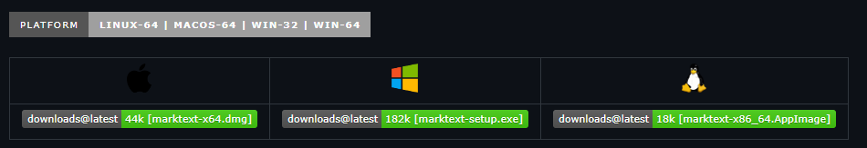
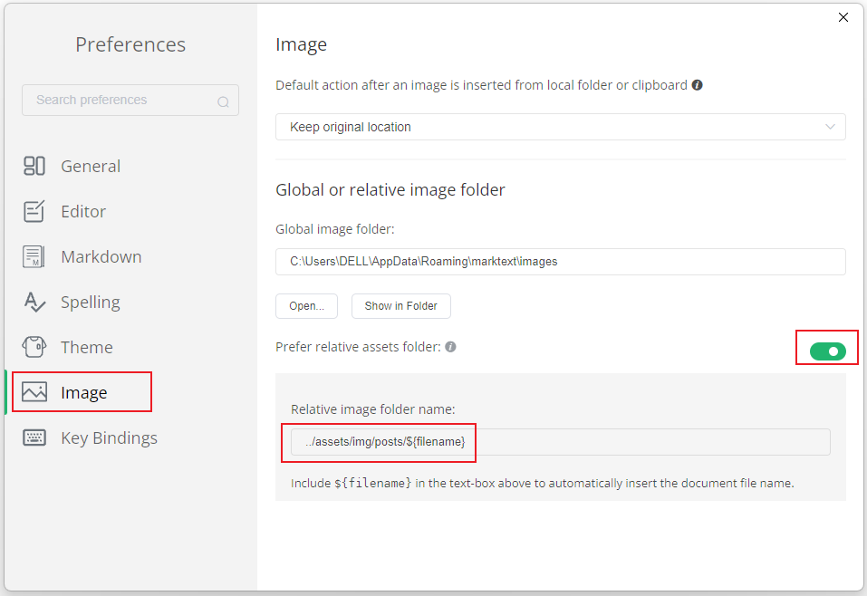

# MarkText


[github](https://github.com/marktext/marktext)

🔆 下一代 markdown 编辑器 editor 🌙

一个简单而优雅的开源markdown编辑器，注重速度和可用性。可用于Linux、macOS和Windows。 

## Screenshot


## Features

- 实时预览(WYSIWYG)和一个干净和简单的界面，以获得无干扰的写作体验。
- Support [CommonMark Spec](https://spec.commonmark.org/0.29/), [GitHub Flavored Markdown Spec](https://github.github.com/gfm/) and selective support [Pandoc markdown](https://pandoc.org/MANUAL.html#pandocs-markdown).
- 支持导出**HTML** 和 **PDF** 文件。
- 支持多个主题。
- 直接从剪贴板粘贴图像。

## Download and Installation

在GitHub上找



## MarkText设置插入图片路径

1. ### 打开应用，用打开文件方式，再点齿轮状的设置按钮。

2. ### click Image

3. ### 开启【相对路径】方式 ，设置图片文件夹相对路径的地址：
   
   ```markdown
   ../assets/img/posts/${filename}
   ```