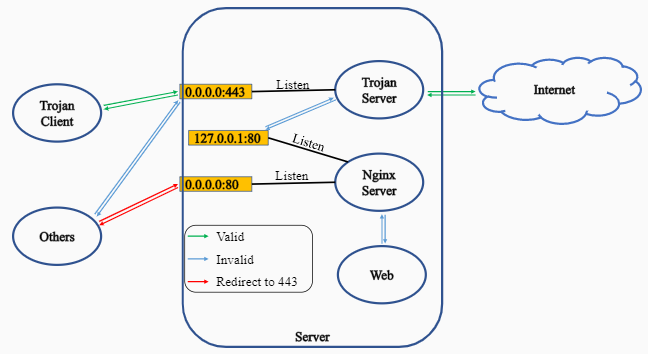
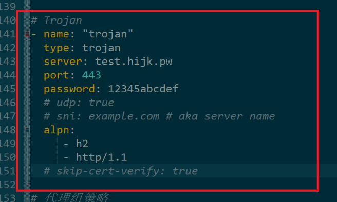

🔆构建自己的Trojan

## trojan简介

**trojan**是近两年兴起的网络工具，项目官网 [Trojan-GFW · GitHub](https://github.com/trojan-gfw)。与强调加密和混淆的SS/SSR等工具不同，trojan将通信流量伪装成互联网上最常见的https流量，从而有效防止流量被检测和干扰。在敏感时期，基本上只有trojan和 [v2ray伪装](https://itlanyan.com/v2ray-traffic-mask/) 能提供稳如狗的体验。

## 实现原理图解



## 安装trojan服务器

### 准备事项

按照本教程部署trojan需要如下前提条件：

1. 有一台运行Linux的境外vps；购买vps可参考：[一些VPS商家整理](https://itlanyan.com/vps-merchant-collection/)；

2. 有一个域名；购买域名可参考：[Namesilo域名注册和使用教程](https://itlanyan.com/namesilo-domain-tutorial/) 或从 [适合国人的域名注册商推荐](https://itlanyan.com/domain-register-for-mainland/) 选购；

3. 将域名的某个子域名(伪装域名)解析到境外VPS的IP；

4. 为域名申请一个证书；请参考 [使用acme.sh签发证书](https://itlanyan.com/use-acme-sh-get-free-cert/) 或 [从阿里云获取免费SSL证书](https://itlanyan.com/get-free-ssl-certificates-from-aliyun/)(伪装域名用来做站推荐使用)；

5. 通过ssh终端连接到vps；

### 安装trojan服务端

本教程服务端系统是CentOS 7，其他系统的命令基本类似，请自行转换。

连到VPS后，终端输入如下命令安装trojan：

连到VPS后，终端输入如下命令安装trojan：

```bash
sudo bash -c "$(curl -fsSL https://raw.githubusercontent.com/trojan-gfw/trojan-quickstart/master/trojan-quickstart.sh)"
```

该命令会下载最新版的trojan并安装。安装完毕后，打开trojan配置文件路径是 `/usr/local/etc/trojan/config.json`:

```bash
sudo vim  /usr/local/etc/trojan/config.json
```

只需修改客户端连接密码和申请的域名证书文件，其他默认即可

```json
{
    "run_type": "server",
    "local_addr": "0.0.0.0",
    "local_port": 443,
    "remote_addr": "127.0.0.1",
    "remote_port": 80,
    "password": [
        "password1", //设置客户端连接密码，不支持特殊符号，可设置多个密码，用于多用户连接使用
        "password2"
    ],
    "log_level": 1,
    "ssl": {
        "cert": "/etc/trojan/trojan.crt", //申请的证书路径.pem后缀文件或.crt后缀文件
        "key": "/etc/trojan/trojan.key", //申请的密钥.key后缀文件
        "key_password": "",
        "cipher": "ECDHE-ECDSA-AES256-GCM-SHA384:ECDHE-RSA-AES256-GCM-SHA384:ECDHE-ECDSA-CHACHA20-POLY1305:ECDHE-RSA-CHACHA20-POLY1305:ECDHE-ECDSA-AES128-GCM-SHA256:ECDHE-RSA-AES128-GCM-SHA256:ECDHE-ECDSA-AES256-SHA384:ECDHE-RSA-AES256-SHA384:ECDHE-ECDSA-AES128-SHA256:ECDHE-RSA-AES128-SHA256",
        "prefer_server_cipher": true,
        "alpn": [
            "http/1.1"
        ],
        "reuse_session": true,
        "session_ticket": false,
        "session_timeout": 600,
        "plain_http_response": "",
        "curves": "",
        "dhparam": ""
    },
    "tcp": {
        "prefer_ipv4": false,
        "no_delay": true,
        "keep_alive": true,
        "fast_open": false,
        "fast_open_qlen": 20
    },
    "mysql": {
        "enabled": false,
        "server_addr": "127.0.0.1",
        "server_port": 3306,
        "database": "trojan",
        "username": "trojan",
        "password": ""
    }
}
```

想了解更多参数配置，官方配置参考->[config](https://trojan-gfw.github.io/trojan/config.html)

请重点关注配置文件中的如下参数：

1.  `local_port`：监听的端口，默认是443，除非端口被墙，不建议改成其他端口；
2.  `remote_addr`和`remote_port`：非trojan协议时，将请求转发处理的地址和端口。可以是任意有效的ip/域名和端口号，默认是本机和80端口；
3. `password`：密码。需要几个密码就填几行，最后一行结尾不能有逗号；
4. `cert`和`key`：域名的证书和密钥，Let’s Encrypt申请的证书可用 `certbot certificates` 查看证书路径。注意不是mysql里面的key和cert！
5. `key_password`：默认没有密码（如果证书文件有密码就要填上）；
6. `alpn`：建议填两行：http/1.1和h2，保持默认也没有问题。

根据自己的需求修改配置文件（大部分参数保持默认即可），保存，然后设置开机启动：`systemctl enable trojan`，并启动trojan： `systemctl start trojan`。

检查trojan是否在运行：`ss -lp | grep trojan`，如果输出为空，可能的原因包括：

1. config.json文件有语法错误：请注意是否少了逗号，有特殊字符等；
2. 开启了selinux： `setenforce 0`关闭再启动 trojan。

### trojan服务端注意事项

以下是一些注意事项：

1. 为了让伪装更正常，配置文件中的 `remote_addr` 和 `remote_port` 请认真填写。如果使用默认的 127.0.0.1 和 80，请运行以下命令安装Nginx并放行80端口：

```bash
yum install -y epel-release && yum install -y nginxsystemctl enable nginx; systemctl start nginxfirewall-cmd --permanent --add-service=httpfirewall-cmd --reload
```

完成后打开浏览器输入域名，应该出现Nginx欢迎页。更换伪装网站页面只需上传文件到 `/usr/share/nginx/html` 目录即可。

2. `remote_addr` 和 `remote_port`也可以填其他ip/域名和端口。例如将所有请求转发到本站，`remote_addr` 填 tlanyan.pp.ua，`remote_port` 填443。**做大死的行为**是remote_addr填 facebook/google/twitter等敏感域名，GFW过来一看可能就直接把你的ip安排得明明白白。

3. 如果vps网页后台有防火墙（阿里云/谷歌云/aws买的服务器），请记得放行相应端口。

到此服务端应该已经安装好并运行正常，接下来是配置客户端使用。

## trojan windows客户端使用教程-Clash for Windows

配置新增一项proxy

```yml
proxies:
    - { name: '🇭🇰 香港 00 | 1x', type: trojan, server: 8.218.85.54, port: 443, sni: jeremiah.ltd, password: password1,  alpn: [http/1.1] }
```



注意：如果server填的ip地址，请取消sni的注释，填上trojan的域名，或者取消skip-cert-verify的注释