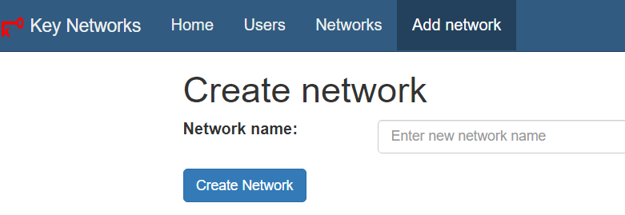
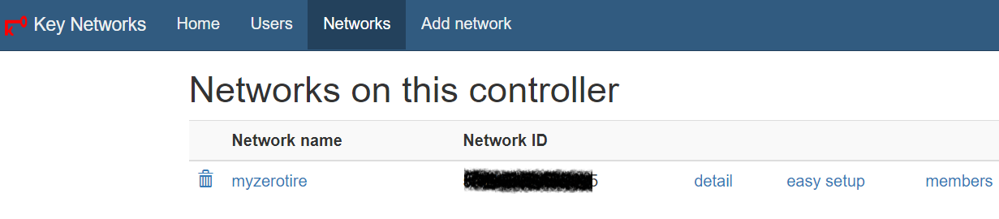

🔆构建自己的SD-WAN

## SD-WAN简介

SD-WAN，全名是Software-Defined WAN，软件定义广域网。WAN，就是Wide Area Network，广域网。

## SD-WAN工具

1. Zerotier

#### 注册*Zerotier*

[https://www.zerotier.com](https://www.zerotier.com)

###### 加入Zerotier网络

```shell
zerotier-cli join 159924d630e1083c
```

##### 自建Zerotier的中间Moon节点

[官网文档链接](https://docs.zerotier.com/zerotier/moons)

Linux：

```shell
curl -s https://install.zerotier.com | sudo bash
```

生成moon.json模板

```shell
cd /var/lib/zerotier-one
zerotier-idtool initmoon identity.public > moon.json 
```

vi 编辑 `moon.json`，修改 `“stableEndpoints”` 为 公网的 IP，以 IPv4 为例，记得带引号：

```json
"stableEndpoints": [ "8.8.8.8/9993" ]
```

生成签名文件

用到上一步中的 moon.json， 执行

```shell
zerotier-idtool genmoon moon.json
```

将 moon 节点加入网络

在Zerotier 安装目录下（/var/lib/zerotier-one）建立文件夹 moons.d，将生成的 .moon文件拷贝进去。  
重启 zerotier，重启电脑。

##### 自建Zerotier的Planet节点

一、安装docker

    使用官方安装脚本自动安装：

```bash
curl -fsSL https://get.docker.com | bash -s docker --mirror Aliyun
```

    安装docker-compose

```bash
sudo apt-get install docker-compose
```

二、安装zerotier-planet

    方法一：

```bash
docker run --restart=on-failure:3 -d --name ztncui -e HTTP_PORT=4000 -e HTTP_ALL_INTERFACES=yes -e ZTNCUI_PASSWD=mrdoc.fun -p 4000:4000 keynetworks/ztncui
```

    方法二：

```bash
git clone https://github.com/Jonnyan404/zerotier-planet
cd zerotier-planet
docker-compose up -d
```

三、创建网络

访问 `http://ip:4000` web界面，按照提示修改密码。

- 用户名:admin
- 密码:mrdoc.fun



1.点击“Add network”，输入名称，点击“Create Network”，即可创建一个网络



2.点击“Networks”，点击“easy setup”，可以按照提示填写默认值，而后就能加入此network了。