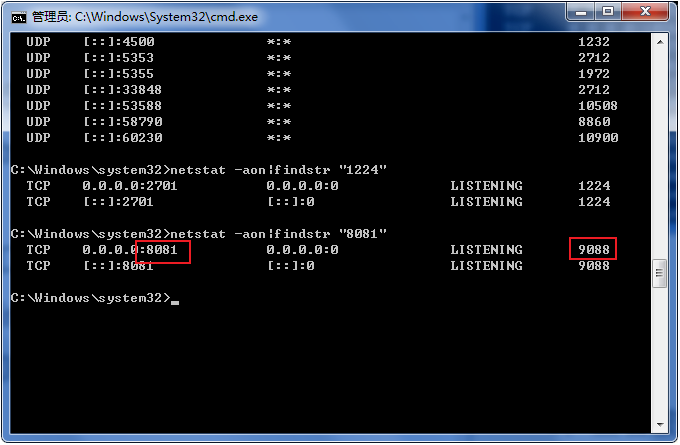
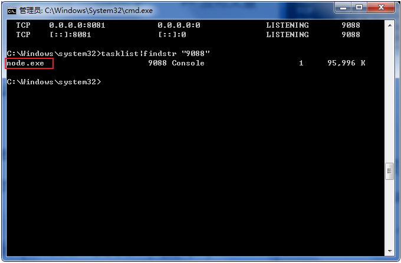
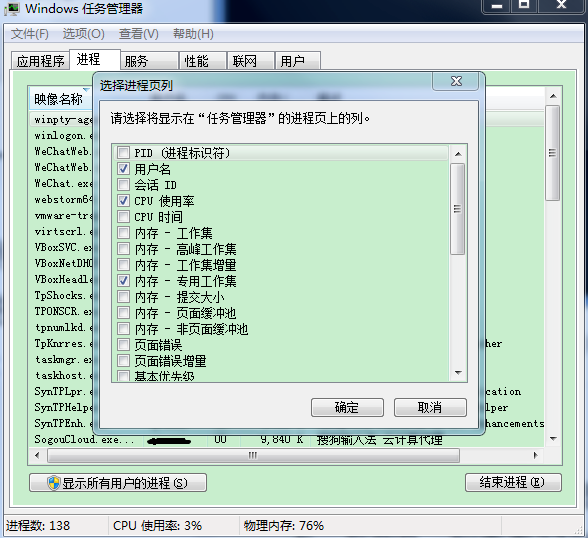

🔆windows端口占用

#### 1、查看被占用端口对应的 PID

输入命令：

```shell
netstat -ano|findstr "8081"
```

回车执行该命令，最后一位数字就是 PID, 这里是 9088。




### 2、查看指定 PID 的进程

继续输入命令：

```shell
tasklist|findstr "9088"
```

回车执行该命令。

查看是哪个进程或者程序占用了 8081 端口，结果是：node.exe。



### 3、结束进程

强制（/F参数）杀死 pid 为 9088 的所有进程包括子进程（/T参数）：

```shell
taskkill /T /F /PID 9088
```

或者是我们打开任务管理器，切换到进程选项卡，在PID一列查看9088对应的进程是谁。



之后我们就可以结束掉这个进程，这样我们就可以释放该端口来使用了。
