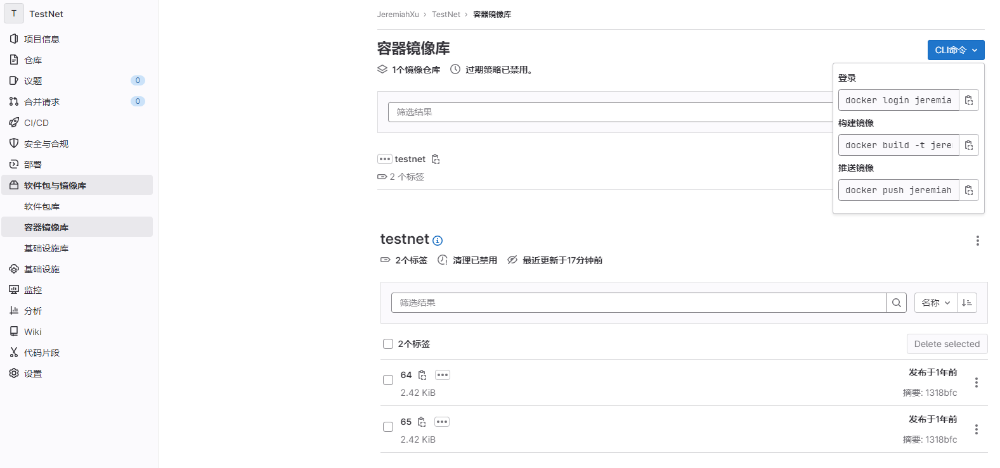

## 

## 设置卷位置

在设置其他所有内容之前，请配置一个新的环境变量 `$GITLAB_HOME`，指向配置、日志和数据文件所在的目录。 确保该目录存在并且已授予适当的权限。

对于 Linux 用户，将路径设置为 `/srv/gitlab`：

```
export GITLAB_HOME=/srv/gitlab
```

### 使用 Docker Compose 安装GitLab

1. [安装 Docker Compose](https://docs.docker.com/compose/install/)。

2. 创建一个 `docker-compose.yml` 文件：
   
   ```
   version: '3.6'
   services:
     web:
       image: 'gitlab/gitlab-ce:latest'
       restart: always
       hostname: 'gitlab.example.com'
       environment:
         GITLAB_OMNIBUS_CONFIG: |
           external_url 'https://gitlab.example.com:8929'
           gitlab_rails['gitlab_shell_ssh_port'] = 2224
           registry_external_url 'https://gitlab.example.com:5050'
           registry['enable'] = true
       ports:
         - '8929:8929'
         - '2224:22'
       volumes:
         - '$GITLAB_HOME/config:/etc/gitlab'
         - '$GITLAB_HOME/logs:/var/log/gitlab'
         - '$GITLAB_HOME/data:/var/opt/gitlab'
       shm_size: '256m'
   ```

3. 确保您在与 `docker-compose.yml` 相同的目录下并启动极狐GitLab：
   
   ```
   docker compose up -d
   ```

初始化过程可能需要很长时间。 您可以通过以下方式跟踪此过程：

```
sudo docker logs -f gitlab-web-1
```

启动容器后，您可以访问 `gitlab.example.com`（如果您在 macOS 上使用 boot2docker，则可以访问 `http://192.168.59.103`）。Docker 容器开始响应查询可能需要一段时间。

访问极狐GitLab URL，并使用用户名 root 和来自以下命令的密码登录：

```
sudo docker exec -it gitlab-web-1 grep 'Password:' /etc/gitlab/initial_root_password
```

密码文件将在 24 小时后的第一次重新配置运行中自动删除。

#### 刷新配置:

```
sudo docker exec -it gitlab-web-1 gitlab-ctl reconfigure
```

## GitLab Runner

### 安装GitLab Runner

1. Docker 安装。
   
   ```
   docker run -d --name gitlab-runner --restart always \
     -v /srv/gitlab-runner/config:/etc/gitlab-runner \
     -v /var/run/docker.sock:/var/run/docker.sock \
     gitlab/gitlab-runner:latest
   ```

2. 你可能会得到日志：
   
   ```
   docker logs gitlab-runner
   ```

### 使用 Docker 容器注册 Runner

交互方式：

1. 基于挂载类型运行注册命令：
   
   对于本地系统卷挂载：
   
   ```
   docker run --rm -it -v /srv/gitlab-runner/config:/etc/gitlab-runner gitlab/gitlab-runner register
   ```

2. 输入您的极狐GitLab 实例 URL（也称为 `gitlab-ci coordinator URL`）。

3. 输入注册 Runner 时获取的令牌。

4. 输入 Runner 描述。您可以在极狐GitLab UI 中进行变更。

5. 输入以逗号隔开的[与 Runner 有关的标签](https://docs.gitlab.cn/jh/ci/runners/configure_runners.html#use-tags-to-control-which-jobs-a-runner-can-run)，您可以后续在极狐GitLab UI 中进行变更。

6. 为 Runner 输入可选的维护记录。

7. 提供 [Runner 执行器](https://docs.gitlab.cn/runner/executors/index.html)。对于大多数用例来说，输入 `docker`。

8. 如果您输入 `docker` 作为执行器。对于在 `.gitlab-ci.yml` 中没有定义镜像的项目，系统会要求您使用默认镜像。

非交互方式：

GitLab Runner注册带https的GitLab

```
docker run --rm -it -v /srv/gitlab-runner/config:/etc/gitlab-runner  gitlab/gitlab-runner register \
  --non-interactive \
  --tls-ca-file=/etc/gitlab-runner/ssl/jeremiah.top.crt  \
  --url "https://jeremiah.top:8929/" \
  --registration-token "GR1348941L5VzCBnqJUUM3m9s1yu7" \
  --executor "docker" \
  --docker-image maven:latest \
  --description "runner " \
  --tag-list "run" \
  --run-untagged \
  --locked="false"
```

#### 解决GitLab-Runner执行脚本命令无权限

参考链接[【汇总】解决GitLab-Runner执行脚本命令无权限](https://blog.csdn.net/qq_39940674/article/details/127616784)

先卸载gitlab-runner。

`./gitlab-runner uninstall`
然后再重新安装，并且设置用户为root。

`./gitlab-runner install --user=root --working-directory=/home/gitlab-runner`
执行启动。

`./gitlab-runner start`
执行ps aux|grep gitlab-runner命令，查看当前启动的用户角色。

可以把主目录的文件权限也改成root。

## Gitlab 配置Container Registry

### 配置embed嵌入式的内部仓库

+ 效果



+ 镜像命名约定
  
  镜像遵循以下命名约定：
  
  ```
  <registry URL>/<namespace>/<project>/<image>
  ```
  
  例如，如果您的项目是 `gitlab.example.com/mynamespace/myproject`，那么您的镜像必须至少命名为 `gitlab.example.com/mynamespace/myproject/my-app`。 
  您可以将其他名称附加到镜像名称的末尾，深度最多为三层。

+ 端口：一定要暴露Registry的5050端口，给Runner使用。特别是docker安装Gitlab的方式。

+ SSL证书：嵌入式的Registry的Https一定配置机构颁发的有效SSL证书。
  
  1. 支持Let's encrypt颁发的证书。注意：使用内置的Let's encrypt，R3机构需要开发80或443端口验证后，才能颁发有效证书。
  2. 配置外部的证书。参数[极狐GitLab手动配置 HTTPS](https://docs.gitlab.cn/omnibus/settings/ssl/#%E6%89%8B%E5%8A%A8%E9%85%8D%E7%BD%AE-https)

### 配置外部的仓库

直接修改gitlab配置文件： vim /etc/gitlab/gitlab.rb

```rust
//外部访问地址，此处被nginx代理，暴露给外部访问
registry_external_url 'http://xxx.com'
//启用
gitlab_rails['registry_enabled'] = true
//registry 服务ip
gitlab_rails['registry_host'] = "172.29.1.70"
//registry 服务真正端口
gitlab_rails['registry_port'] = "5000"
```

这里需要注意的是，registry_external_url是外部访问的url，如docker需要pull和push，都是访问该路径。然后，刷新配置，重启：

```shell
gitlab-ctl reconfigure
gitlab-ctl restart
```

这个时候，可以在浏览器访问下registry_external_url。
