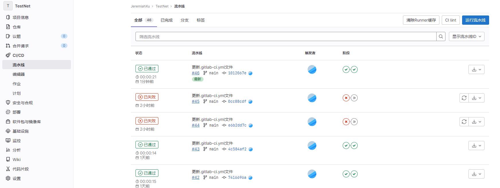
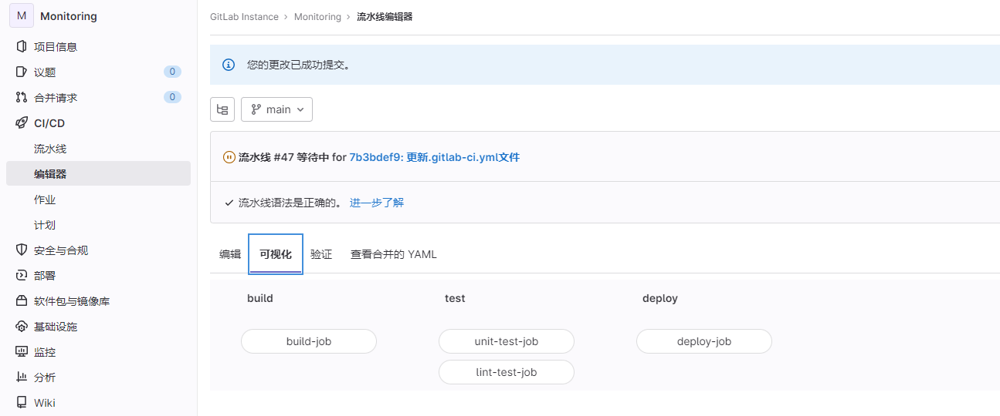

`GitLab CI` 生成 `artifact`



### CI编辑器

可视化

编辑

```yaml
# 这个文件是一个模板，在你的项目上工作之前可能需要编辑。
# 这是一个示例 GitLab CI/CD 配置文件，无需任何修改即可运行。
# 它演示了一个基本的 3 阶段 CI/CD 管道。 而不是真正的测试或脚本，
# 它使用 echo 命令来模拟管道执行。
#
# 管道由运行脚本的独立作业组成，分为阶段。
# 阶段按顺序运行，但阶段内的作业并行运行。
#
# For more information, see: https://docs.gitlab.com/ee/ci/yaml/index.html#stages
#
# 您可以将此模板复制并粘贴到新的 `.gitlab-ci.yml` 文件中。
# 您不应使用 `include:` 关键字将此模板添加到现有的 `.gitlab-ci.yml` 文件中。
#
# 要改进 CI/CD 模板，请遵循开发指南：
# https://docs.gitlab.com/ee/development/cicd/templates.html

stages:          # List of stages for jobs, and their order of execution
  - build
  - test
  - deploy

build-job:       # This job runs in the build stage, which runs first.
  stage: build
  script:
    - echo "Compiling the code..."
    - echo "Compile complete."

unit-test-job:   # This job runs in the test stage.
  stage: test    # It only starts when the job in the build stage completes successfully.
  script:
    - echo "Running unit tests... This will take about 60 seconds."
    - sleep 60
    - echo "Code coverage is 90%"

lint-test-job:   # This job also runs in the test stage.
  stage: test    # It can run at the same time as unit-test-job (in parallel).
  script:
    - echo "Linting code... This will take about 10 seconds."
    - sleep 10
    - echo "No lint issues found."

deploy-job:      # This job runs in the deploy stage.
  stage: deploy  # It only runs when *both* jobs in the test stage complete successfully.
  environment: production
  script:
    - echo "Deploying application..."
    - echo "Application successfully deployed."
```

注意：**tags**

Job定义用哪个Runner运行，标记那个Runner的tag即可：

```yaml
build-job:       # This job runs in the build stage, which runs first.
  stage: build
  tags:
    - run4
```

### 使用kaniko方式构建docker镜像

优势：比Docker in docker(dind)方式更加安全

注意：中国大陆服务器拉取不到`gcr.io/kaniko-project/executor:debug`基础镜像，已经转存在`jeremiahxuj/kaniko-project-executor:v1.9.1-debug`地址。

编写`gitlab-ci.yml`文件：

```yml
build-job:   # This job runs in the test stage.
  stage: build    # It only starts when the job in the build stage completes successfully.
  tags:
    - TestNet-run5
  image:
    name: jeremiahxuj/kaniko-project-executor:v1.9.1-debug
    entrypoint: [""]
  before_script:
    - echo $CI_PIPELINE_IID
    - export IMAGE_TAG=$CI_PIPELINE_IID
    - echo $IMAGE_TAG
    - mkdir -p /kaniko/.docker
    # Write credentials to access Gitlab Container Registry within the runner/ci
    # - echo "{\"auths\":{\"$CI_REGISTRY\":{\"auth\":\"$(echo -n ${CI_REGISTRY_USER}:${CI_REGISTRY_PASSWORD} | base64 | tr -d '\n')\"}}}" > /kaniko/.docker/config.json
    # Build and push the container. To disable push add --no-push
    # - docker pull hello-world
    # - docker login jeremiah.top:7443 -u root -p dd
    - echo "begin build."
  script:
    - /kaniko/executor
      --context "${CI_PROJECT_DIR}"
      --dockerfile "${CI_PROJECT_DIR}/Dockerfile"
      --destination $CI_REGISTRY_IMAGE:$IMAGE_TAG
```
