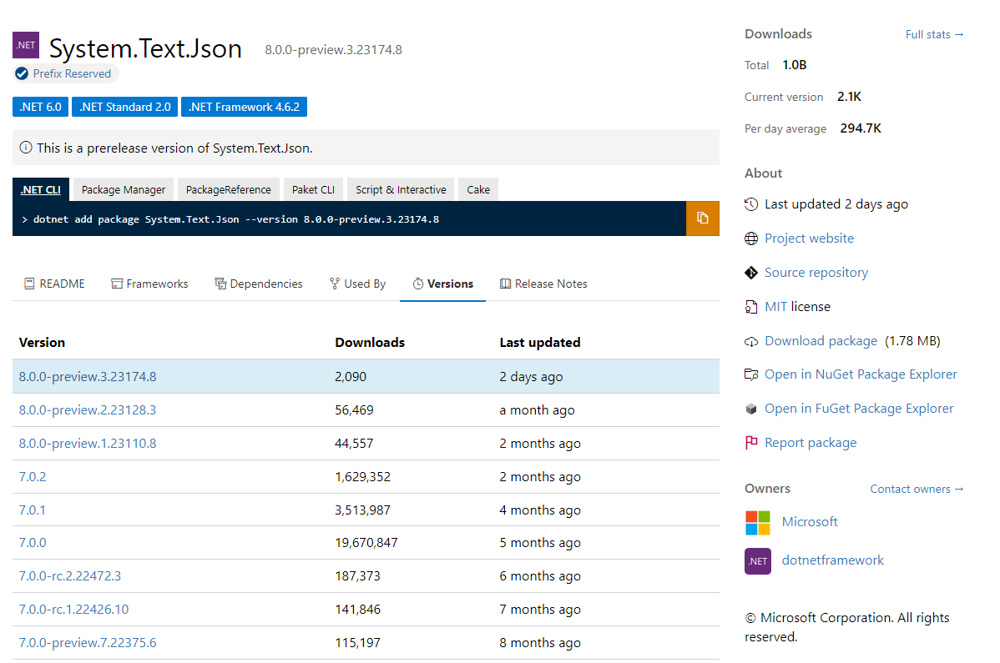

## 打包Nuget包

```sh
dotnet pack
```

## 打包Nuget symbol 包 ([.snupkg](https://learn.microsoft.com/en-us/nuget/create-packages/symbol-packages-snupkg))

添加下面的内容到你的项目`.csproj`文件：

```xml
<PropertyGroup>
    <IncludeSymbols>true</IncludeSymbols>
    <SymbolPackageFormat>snupkg</SymbolPackageFormat>
</PropertyGroup>
```

或者，命令行方式：

```sh
dotnet pack -p:IncludeSymbols=true -p:SymbolPackageFormat=snupkg
```

## 调试Nuget包

#### 本地方式1：改引用项目的方式

1. 在nuget包管理器中卸载使用的nuget包

2. 添加源码的项目进入使用的解决方案

3. 在解决方案中，改用引用项目的方式

4. 开始调试...

#### 本地方式2：使用本地源码生成的nuget包和snupkg符号包。

snupkg符号包，将本地的源码的行号信息暴露，使用时可直接显示外部杂项文件。直接调试...

1. 在解决方案中，改用本地nuget包

#### 线上方式1：使用Source Server的方式

开启第三方符号服务器的支持，e.g. ProGet包服务器

#### 线上方式2：使用[source link](https://github.com/dotnet/sourcelink)的方式（推荐）

1. 将nuget包和snupkg符号包，上传到微软[nuget.org包服务器](https://www.nuget.org/packages)、[azure artifacts包服务器]()等
   
   参考：[如何发布 NuGet 包  Microsoft Learn](https://learn.microsoft.com/zh-cn/nuget/nuget-org/publish-a-package)
   
   

2. 将源码，上传到github、azure repos等服务器

3. 在VS中调试...
   
   提示：Visual Studio 2017 15.3以上版本中已经集成了Source Link, 具体开启方式如下
   
   + 首先在 Options > Debugging > General > 关闭Just My Code, +启用Enable Source Link Support
   
   + 然后在 Options > Debugging > Symbols > 启用Microsoft Symbol Servers

**线上1、2方式都需要符号支持，第三方可以从nuget.org符号服务器中下载**

#### 参考

1. [Inedo Blog: 调试NuGet包和编辑库的两种简单方法](https://blog.inedo.com/nuget/how-to-debug-nuget-packages-the-painless-way/)

2. [微软PDB、SourceLink——.net core之nuget 包调试你了解吗？花10分钟看看你就懂了！](https://blog.csdn.net/weixin_51954021/article/details/112188179)

3. [使用 Azure Pipelines 发布 NuGet 包](https://learn.microsoft.com/zh-cn/azure/devops/pipelines/artifacts/nuget?view=azure-devops&tabs=yaml)

4. [调试本地DLL.](https://spin.atomicobject.com/2018/01/29/debugging-nuget-package/)

5. [Improving Debug-time Productivity with Source Link - .NET Blog](https://devblogs.microsoft.com/dotnet/improving-debug-time-productivity-with-source-link/)

6. [Decompile .NET code while debugging - Visual Studio (Windows)  Microsoft Learn](https://learn.microsoft.com/en-us/visualstudio/debugger/decompilation?view=vs-2022)

7. [Symbol / PDB files in the Visual Studio debugger  Microsoft Learn](https://learn.microsoft.com/en-us/visualstudio/debugger/specify-symbol-dot-pdb-and-source-files-in-the-visual-studio-debugger?view=vs-2019#configure-symbol-locations-and-loading-options)


