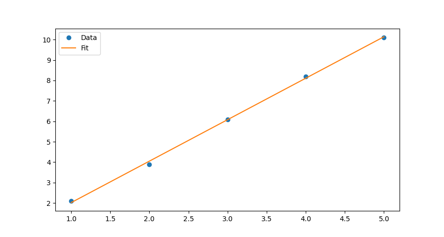

## NumPy库

参考：

1. [https://numpy.org/](https://numpy.org/)
2. [GitHub - numpy/numpy: The fundamental package for scientific computing with Python.](https://github.com/numpy/numpy)

在NumPy中，可以使用`numpy.polyfit()`函数实现最小二乘法直线拟合。例如，我们有以下数据集：

```bash
pip install numpy
# 使用国内清华库
pip install numpy -i https://pypi.tuna.tsinghua.edu.cn/simple
```

```python
import numpy as np

x = np.array([1, 2, 3, 4, 5])
y = np.array([2.1, 3.9, 6.1, 8.2, 10.1])
```

其中`x`和`y`分别表示自变量和因变量的取值。我们希望找到这些数据的一条最小二乘法直线。

在使用`numpy.polyfit()`函数进行拟合前，需要确定需要拟合的模型的次数，这里选择拟合一次多项式模型（即直线），因此设置`deg=1`。代码如下：

```python
coefficients = np.polyfit(x, y, deg=1)
```

执行上述代码后，`coefficients`将包含两个浮点数，分别表示数据集的一次多项式方程中一次项和零次项系数。这样我们可以得到一条最小二乘法直线的函数表达式：

```python
Slope = coefficients[0]
Intercept = coefficients[1]
line = Slope * x + Intercept
```

现在，我们可以使用matplotlib绘制数据点和最小二乘法直线：

```python
import matplotlib.pyplot as plt

plt.plot(x, y, 'o', label='Data')
plt.plot(x, line, label='Fit')
plt.legend()
plt.show()
```

这将在绘图窗口中显示一条最小二乘法直线和数据点，如下图所示：



以上示例展示了如何使用NumPy进行最小二乘法直线拟合，同时NumPy还提供了其它数值计算函数和工具，例如矩阵运算、傅里叶变换、随机数生成等，可以用于科学计算、数据分析等领域。

## Math.NET Numerics 库

参考：

1. [https://github.com/mathnet/mathnet-numerics](https://github.com/mathnet/mathnet-numerics)

2. [https://numerics.mathdotnet.com/Regression.html#Linear-Model](https://numerics.mathdotnet.com/Regression.html#Linear-Model)

以下是一个使用 Math.NET Numerics 库进行最小二乘法直线拟合的示例：

假设我们有一组数据点 (1, 1), (2, 3), (3, 5), (4, 7), (5, 9)，现在希望使用最小二乘法拟合这些数据点，得到一条直线 y = kx + b。

首先需要引入 Math.NET Numerics 库：

```csharp
using MathNet.Numerics.LinearRegression;
```

然后，将数据点存储在两个数组中：

```csharp
double[] x = new double[] { 1, 2, 3, 4, 5 };
double[] y = new double[] { 1, 3, 5, 7, 9 };
```

接下来，使用 MathNet.Numerics 库的简单线性回归方法进行拟合：

```csharp
using MathNet.Numerics.LinearRegression;

SimpleLinearRegression regression = SimpleLinearRegression.Fit(x, y);
double k = regression.Slope;
double b = regression.Intercept;
```

最后得到的结果是：k = 2，b = -1。

因此，最小二乘法拟合得到的直线方程为 y = 2x - 1。

需要注意的是，如果数据点不符合线性关系，则无法使用最小二乘法直线拟合。此时需要尝试其他拟合方法，如二次多项式拟合等。